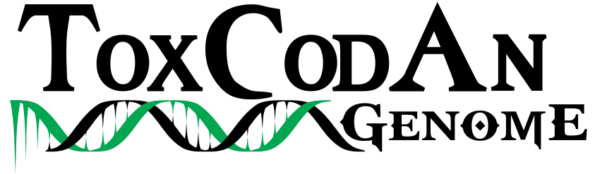

# The guide to annotate toxin genes in genomes

## Summary

- [Introduction](#introduction)
- [Toxin annotation](#toxin-annotation)
	- [ToxCodAnGenome](#toxcodangenome)
	- [Checking annotations](#checking-annotations)
- [NonToxin annotation](#nontoxin-annotation)
- [Extra: Plotting toxin loci](#plotting-toxin-loci)

# Introduction
The Guide to performing toxin gene annotation in genomes is part of [**ToxCodAn-Genome**](https://github.com/pedronachtigall/ToxCodAn-Genome) and designed to walk you through our toxin annotation pipeline.

Before start and walking through the guide, it will be good to have some basic knowledge about bioinformatics.

If you don't have much experience in using command lines, running programs, or bioinformatics in general, then you can follow the ["Basic Bioinformatics"](https://github.com/pedronachtigall/ToxCodAn/tree/master/Guide#basic-bioinformatics) section in the ToxCodAn's guide to venom gland transcriptomes. This section has some general resources and information that may help you to better understand bioinformatics and the rest of this Guide. The Guide is not designed to teach you *everything*, so we highly recommend working through the training resources first!

# Toxin annotation

## ToxCodAnGenome

### Toxin database

We have designed toxin database with curated toxin CDSs for ..., which can be downloaded [here](https://github.com/pedronachtigall/ToxCodAn-Genome/tree/main/database/).

### Custom toxin database

If you and your research group have been extensively working within the venomous taxa of the species being analyzed and have a well-curated set of toxin CDSs available in [FASTA](https://en.wikipedia.org/wiki/FASTA_format) format, it can be used as the toxin database or integrate some of the available toxin databases.

If using a custom toxin database as the only toxin database, just set the path to the custom database file with the parameter ```-d```. In this case, ensure you have the toxin family annotated in the header of each toxin CDS after an ```_``` ("underscore") symbol (e.g., ```>Sequence1_TOXIN```).
 - **Tip:** If your database only contains one toxin family, it can be easily done with [Perl](https://www.perl.org/):
     - ```perl -p -e "s/^(>.*)$/$1_TOXIN/g" custom_toxin_db.fasta > custom_toxin_db_renamed.fasta```
     - replace ```"_TOXIN"``` to the target toxin family

If you want to integrate some of the ToxCodAn-Genome's toxin database, just indicate the path to the custom toxin database file with the parameter ```-C```. In this case, you will not need to specify the toxin family in the header (as previously described); however, if it is not specified, the ToxCodAn-Genome will consider the sequence as a "generic" toxin, by adding a string ```_TOXIN``` at the end of header of each sequence (e.g., ```>Sequence1_TOXIN```). We strongly recommend to perform the annotation and add the toxin family in each sequence header to facilitate downstream analysis.

#### Curated toxin CDS set

#### Venom tissue transcriptome
If you have venom tissue transcriptomic data available for the species being annotated, you should consider using this data in the toxin annotation step to improve the final set generated by ToxCodAn-Genome. In this sense, you can detect the toxin CDSs and annotate them by following your own pipeline, or follow the guide to venom gland transcriptomics available within [ToxCodAn](https://github.com/pedronachtigall/ToxCodAn/tree/master/Guide#the-guide) tool and published in [Briefings in Bioinformatics](https://doi.org/10.1093/bib/bbab095).

If you and your research group do not have a strong background in performing such transcriptome annotation, we designed two scripts to help on this task that can be run separately or integrated into the main ToxCodAn-Genome pipeline.

<details>
<summary>Expand "Transcriptome Assembly" Section</summary>

**Pre-processing of reads**

First, ensure that the adapters are trimmed and low-quality reads filtered. It can be performed by using any available tool, such as [trim_galore!](https://github.com/FelixKrueger/TrimGalore), [fastp](https://github.com/OpenGene/fastp), and many others. Here, we just set a simple command to run ```trim_galore```:
 - ```trim_galore --paired --phred33 --length 75 -q 25 --stringency 1 -e 0.1 -o sample_trimmed sample_r1.fastq.gz sample_r2.fastq.gz```

After removing adapters and low-quality reads, you can move to the transcriptome assembly step.

**Transcriptome assembly**

We designed a script to run transcriptome assembly to run the genome-guided methods of [Trinity](https://github.com/trinityrnaseq/trinityrnaseq/wiki) and [stringtie](https://ccb.jhu.edu/software/stringtie/) and the *de novo* method of Trinity and [rnaSPAdes](https://cab.spbu.ru/software/spades/) to assemble most of the toxin transcripts in the dataset ([Holding et al., 2018](https://doi.org/10.3390/toxins10060249)).

If using paired-end reads:
```
TRassembly.py -g genome.fasta -r reads_1.fastq(.gz),reads_2.fastq(.gz) -c 20 -M 20G
```

If using single-end reads (or merged reads):
```
TRassembly.py -g genome.fasta -r reads.fastq(.gz) -c 20 -M 20G
```

 - The final transcriptome assembly: "assembly/transcripts.fasta". The output directory can be changed by using the parameter ```-o```
 - Please adjust the number of threads ```-c``` and memory usage ```-M``` accordingly to your system.
 - Run ```TRassembly.py -h``` to print the help message.
 - It may take a while to finish.

You may also run each assembler and method separately and also consider using several other tools to increase the probability of retrieving most of the toxin transcripts (once it was not thoroughly tested to all venomous lineage and it still needs improvement), it can be performed by following the instructions [here](https://github.com/pedronachtigall/ToxCodAn/tree/master/Guide#transcriptome-assembly).

- **Tip about transcriptome assembly:** if using a paired-end read dataset, you may consider merging reads to improve the *de novo* assembly by using [PEAR](https://www.h-its.org/software/pear-paired-end-read-merger/). It will increase the size of the reads by merging pairs with high-quality overlap.
	- ```pear -k -j 20 -f sample_r1.fastq.gz -r sample_r1.fastq.gz -o sample_merged_reads```
	- ```-j``` is the number of threads, adjust accordingly.

 - **Tip about Trinity:** if using a paired-end read dataset, ensure the number of reads in both files match. If the number of reads does not match, Trinity may return an error and stop the assembling step. To avoid this issue, you can merge reads as described above or you can take advantage of [seqtk](https://github.com/lh3/seqtk) to subsample your dataset to a specific number of reads in both files.
	- ```seqtk sample -s100 sample_r1.fastq 5000000 > sample_sub1.fastq```
	- ```seqtk sample -s100 sample_r2.fastq 5000000 > sample_sub2.fastq```
	- always use the same random seed to keep a proper pair in both files (parameters ```-s```, which is set to ```100``` in our example).
	- here we set the number of reads to 5 million (```5000000```), but it must be adjusted accordingly to your dataset.


</details>
<br>

<details>
<summary>Expand "Toxin CDS annotation" Section</summary>

</details>
<br>

### Running ToxCodAn-Genome

## Checking annotations

### Checking reliable annotations

### Checking warning annotations

### Checking matched regions with no annotation

# NonToxin annotation

# Plotting toxin loci
