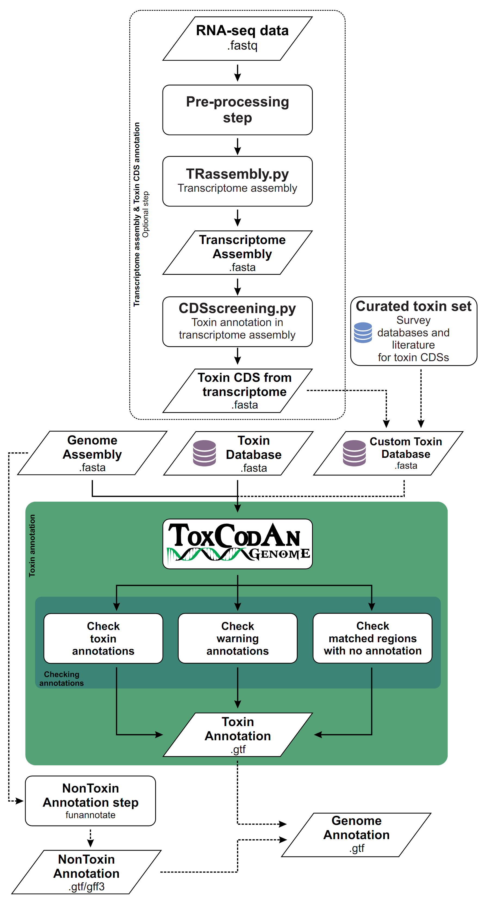
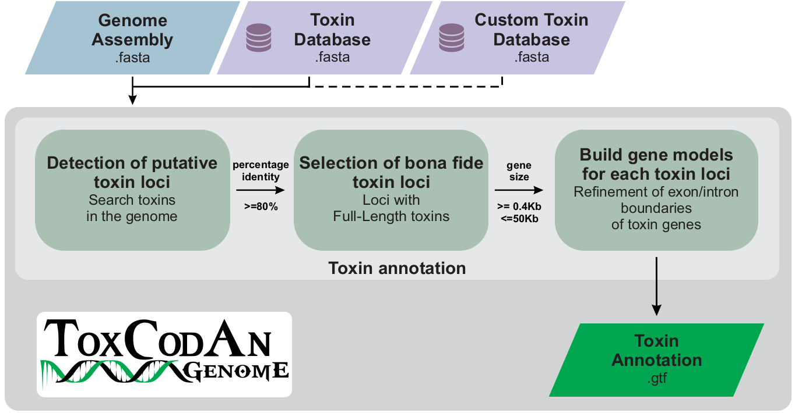
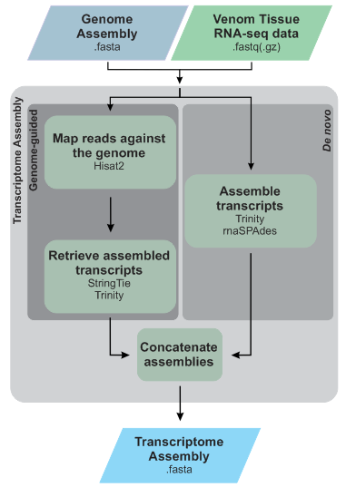
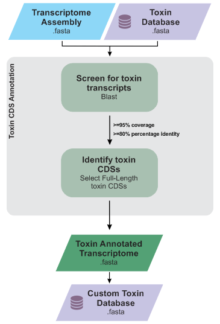
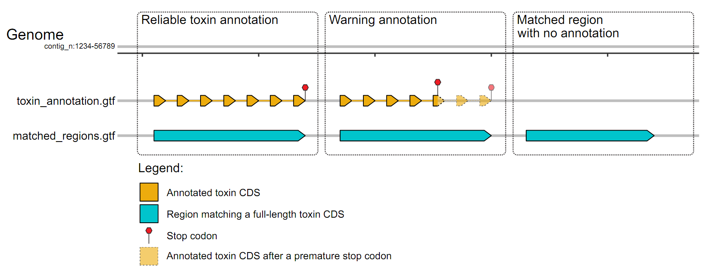

<div align="center">
<center>


# The guide to annotate toxin genes in genomes
### Pedro G. Nachtigall

</center>
</div>

### Summary

- [Introduction](#introduction)
- [The guide to toxin annotation](#the-guide-to-toxin-annotation)
	- [ToxCodAn-Genome](#toxcodan-genome)
		- [Toxin database](#toxin-database)
		- [Custom toxin database](#custom-toxin-database)
		- [Running ToxCodAn-Genome](#running-toxcodan-genome)
	- [Checking annotations](#checking-annotations)
		- [Checking toxin annotations](#checking-toxin-annotations)
		- [Checking warning annotations](#checking-warning-annotations)
		- [Checking matched regions with no annotation](#checking-matched-regions-with-no-annotation)
- [NonToxin annotation](#nontoxin-annotation)
- [Extra: Plotting toxin loci](#plotting-toxin-loci)

# Introduction
The Guide to performing toxin gene annotation in genomes is part of [**ToxCodAn-Genome**](https://github.com/pedronachtigall/ToxCodAn-Genome) and designed to walk you through our toxin annotation pipeline.

Before start and walking through the guide, it will be good to have some basic knowledge about bioinformatics.

If you don't have much experience in using command lines, running programs, or bioinformatics in general, then you can follow the ["Basic Bioinformatics"](https://github.com/pedronachtigall/ToxCodAn/tree/master/Guide#basic-bioinformatics) section in the ToxCodAn's guide to venom gland transcriptomes <sup>[Nachtigall et al., 2021](https://doi.org/10.1093/bib/bbab095)</sup>. This section has some general resources and information that may help you to better understand bioinformatics and the rest of this Guide. The Guide is not designed to teach you *everything*, so we highly recommend working through the training resources first!

# The guide to toxin annotation

<div align="center">
<center>



</center>
</div>

## ToxCodAn-Genome

[**ToxCodAn-Genome**](https://github.com/pedronachtigall/ToxCodAn-Genome) was designed to identify and annotate toxins in genomes of venomous lineages. It consists of a step to detect putative toxin loci among the genome using a comprehensive toxin database, followed by a step to select bonafide toxin loci that are used to build gene models specific to each toxin loci and generate the toxin annotation file.

<div align="center">
<center>



</center>
</div>

### Toxin database

We have designed a toxin database with curated toxin CDSs for some venomous lineages, which can be downloaded [here](https://github.com/pedronachtigall/ToxCodAn-Genome/tree/main/Databases).

The toxin database must be specified with the ```-d``` parameter (e.g., ```-d toxin_database.fasta```).

If you are working with some venomous lineage that is still not available in our toxin database list, you can design a custom toxin database as described below.

### Custom toxin database

If you and your research group have been extensively working within the venomous taxa of the species being analyzed and have a well-curated set of toxin CDSs available in [FASTA](https://en.wikipedia.org/wiki/FASTA_format) format, it can be used as the toxin database or integrate some of the available toxin databases.

If using a custom toxin database as the only toxin database, just set the path to the custom database file with the parameter ```-d```. In this case, ensure you have the toxin family annotated in the header of each toxin CDS after an ```_``` ("underscore") symbol (e.g., ```>Sequence1_TOXIN```).
 - ***Tip:*** If your database only contains one toxin family, it can be easily done with [Perl](https://www.perl.org/):
     - ```perl -p -e 's/^(>.*)$/$1_TOXIN/g' custom_toxin_db.fasta > custom_toxin_db_renamed.fasta```
     - Replace ```"_TOXIN"``` to the target toxin family (e.g., for snake venom metalloproteinase use ```"_SVMP"``` and so on).

If you want to integrate some of the ToxCodAn-Genome's toxin database, just indicate the path to the custom toxin database file with the parameter ```-C``` (e.g., it must something like ```-d toxin_database.fasta -C custom_toxin_db.fasta```). In this case, you will not need to specify the toxin family in the header (as previously described); however, if it is not specified, the ToxCodAn-Genome will consider the sequence as a "generic" toxin, by adding a string ```_TOXIN``` at the end of header of each sequence (e.g., ```>Sequence1_TOXIN```). We strongly recommend to perform the annotation and add the toxin family in each sequence header to facilitate downstream analysis.

If you don't have a set of curated toxin CDS to use as the main toxin database or as a custom toxin database, you can follow any or both strategies to survey for "curated toxin CDSs" in scientific databases and literature and to survey for toxin CDSs from "venom tissue transcriptome".

#### Curated toxin CDS set

To design a set of curated toxin CDSs, you may survey available data in sequence databases, such as [TSA](https://www.ncbi.nlm.nih.gov/genbank/TSA) and [Genbank](https://www.ncbi.nlm.nih.gov/genbank/) from NCBI, [EMBL-EBI](https://www.ebi.ac.uk/), [ENSEMBL](https://www.ensembl.org/index.html), [CNGBdb](https://db.cngb.org/) (China National GeneBank DataBase), and repositories and databases designed to specific genomes/purposes. You can take advantage of the well-designed search engine of these databases by using "keywords" that may help you to retrieve a high-quality set of toxin CDSs.

Here, we briefly described how to search for complete CDSs of the toxin SVMP (snake venom metalloproteinase) of vipers available in NCBI as an example, but you can easily modify the search parameters and use other databases to design a specific set of sequences for your purposes.

 - Access the GenBank website: https://www.ncbi.nlm.nih.gov/genbank/
 - Use the following set of keywords in the: ```Viperidae AND snake venom metalloproteinase AND "complete cds"```
 - Download the result in GenBank format:
	- "send to:" -> "Complete Record" -> "File" -> "Format: GenBank" -> "Creat File"
	- You can download the data in any other format, like downloading the "coding sequence" in FASTA format. But you may adjust the header of sequences accordingly (see ["Custom toxin database"](https://github.com/pedronachtigall/ToxCodAn-Genome/edit/main/Guide/README.md#custom-toxin-database) above).
 - Run our script to retrieve the toxin CDSs and have it ready to use with ToxCodAn-Genome:
	- ```ParseGenBank.py inut.gb output_cds.fasta TOXIN```
	- Replace ```"TOXIN"``` to the target toxin family (e.g., ```"SVMP"``` for snake venom metalloproteinase).

You can also search for RNA-seq data from venom tissue to be re-analyzed. These datasets can be downloaded, the toxin transcripts assembled and its toxin CDSs annotated and retrieved to be used as a Toxin Database. You can follow any available pipeline, [ToxCodAn's guide](https://github.com/pedronachtigall/ToxCodAn/tree/master/Guide#the-guide) to venom gland transcriptomes, or the ["Venom tissue transcriptome"](https://github.com/pedronachtigall/ToxCodAn-Genome/blob/main/Guide/README.md#venom-tissue-transcriptome) section below.

Additionally, you can also survey for accession numbers and links to the datasets of toxin CDSs in published manuscripts (in the "data availability" sections) or within its supplementary files (some authors usually keep its curated sequences in supplementary files or deposited in other databases rather than NCBI's GenBank/TSA, such as [figshare](https://figshare.com/) and [dryad](https://datadryad.org/stash)). You can also contact authors to request such toxin CDSs when not available in any specific database and/or supplementary file.

 - ***Tip:*** To better curate a toxin set and ensure that you have designed a high-quality set, it is good to acquire knowledge about the toxins, their protein domains, and also about the venomous lineage being studied.
	- You can find details about venomous lineages and their toxins in [VenomZone](https://venomzone.expasy.org/), which is a good resource to retrieve information on venoms from six taxa (snakes, scorpions, spiders, cone snails, sea anemones, and insects), as well as on their biological targets and effects. It also has a description of the protein domains of each toxin family and links to retrieve its peptide sequences from [ToxProt](https://www.uniprot.org/help/Toxins)/[Uniprot](https://legacy.uniprot.org/).
	- You can also use the protein id from specific toxins to access its information in Uniprot and better understand the structure of domains of these toxins (e.g., https://legacy.uniprot.org/uniprot/Q9W6M5).
	- To identify protein domains and signal peptide in the identified toxins and check if it presents the expected toxin structure, you can use some web-servers like [HMMER](https://www.ebi.ac.uk/Tools/hmmer/), [InterProScan](https://www.ebi.ac.uk/interpro/search/sequence/), and [SignalP](https://services.healthtech.dtu.dk/service.php?SignalP).
	- You can also survey the literature to find reviews about specific toxin families and venomous lineages.

#### Venom tissue transcriptome

If you have venom tissue transcriptomic data available for the species being annotated, you should consider using this data in the toxin annotation step to improve the final set generated by ToxCodAn-Genome. In this sense, you can detect the toxin CDSs and annotate them by following your own pipeline, or follow the guide to venom gland transcriptomics available within [ToxCodAn](https://github.com/pedronachtigall/ToxCodAn/tree/master/Guide#the-guide) tool and published in Briefings in Bioinformatics <sup>[Nachtigall et al., 2021](https://doi.org/10.1093/bib/bbab095)</sup>.

If you and your research group do not have a strong background in performing such transcriptome annotation, we designed two scripts to help on this task that can be run separately or integrated into the main ToxCodAn-Genome pipeline.

<details>
<summary>Expand "Transcriptome Assembly" Section</summary>

<div align="center">
<center>



</center>
</div>

**Pre-processing of reads**

First, ensure that the adapters are trimmed and low-quality reads filtered. It can be performed by using any available tool, such as [trim_galore!](https://github.com/FelixKrueger/TrimGalore), [fastp](https://github.com/OpenGene/fastp), and many others. Here, we just set a simple command to run ```trim_galore```:
 - ```trim_galore --paired --phred33 --length 75 -q 25 --stringency 1 -e 0.1 -o sample_trimmed sample_r1.fastq.gz sample_r2.fastq.gz```

After removing adapters and low-quality reads, you can move to the transcriptome assembly step.

**Transcriptome assembly**

We designed a script to run transcriptome assembly to run the genome-guided methods of [Trinity](https://github.com/trinityrnaseq/trinityrnaseq/wiki) and [StringTie](https://ccb.jhu.edu/software/stringtie/) and the *de novo* method of Trinity and [rnaSPAdes](https://cab.spbu.ru/software/spades/) to assemble most of the toxin transcripts in the dataset <sup>[Holding et al., 2018](https://doi.org/10.3390/toxins10060249)</sup>.

If using paired-end reads:
```
TRassembly.py -g genome.fasta -r sample_r1.fastq.gz,sample_r2.fastq.gz -c 20 -M 20G
```

If using single-end reads (or merged reads):
```
TRassembly.py -g genome.fasta -r sample_reads.fastq.gz -c 20 -M 20G
```

 - The final transcriptome assembly can be found at ```assembly/transcripts.fasta```. The output directory can be changed by using the parameter ```-o```.
 - Please adjust the number of threads ```-c``` and memory usage ```-M``` accordingly to your system.
 - Run ```TRassembly.py -h``` to print the help message.
 - ```TRassembly.py``` handles both type of files: ```.fastq``` and ```.fastq.gz```.
 - It may take a while to finish!

You may also run each assembler and method separately and also consider using other tools (e.g., extender, NGEN, velvet, etc) to increase the probability of retrieving most of the toxin transcripts. We strongly recommend you to test several assemblers and paremeters to ensure a high-quality toxin transcripts assembly, because it was not thoroughly tested to all venomous lineage and it is a step that still needs improvement. You can follow the instructions to run other assemblers [here](https://github.com/pedronachtigall/ToxCodAn/tree/master/Guide#transcriptome-assembly).

- ***Tip about transcriptome assembly:*** if using a paired-end read dataset, you may consider merging reads to improve the *de novo* assembly by using [PEAR](https://www.h-its.org/software/pear-paired-end-read-merger/). It will increase the size of the reads by merging pairs with high-quality overlap.
	- ```pear -k -j 20 -f sample_r1.fastq.gz -r sample_r1.fastq.gz -o sample_merged_reads```
	- ```-j``` is the number of threads, adjust accordingly.

 - ***Tip about Trinity:*** if using a paired-end read dataset, ensure the number of reads in both files match. If the number of reads does not match, Trinity may return an error and stop the assembling step. To avoid this issue, you can merge reads as described above or you can take advantage of [seqtk](https://github.com/lh3/seqtk) to subsample your dataset to a specific number of reads in both files.
	- ```seqtk sample -s100 sample_r1.fastq 5000000 > sample_sub1.fastq```
	- ```seqtk sample -s100 sample_r2.fastq 5000000 > sample_sub2.fastq```
	- Always use the same random seed to keep a proper pair in both files (parameters ```-s```, which is set to ```100``` in our example).
	- Here we set the number of reads to 5 million (```5000000```), but it must be adjusted accordingly to your dataset.


</details>
<br>

<details>
<summary>Expand "Toxin CDS annotation" Section</summary>

<div align="center">
<center>



</center>
</div>

**Toxin CDS annotation**

We designed a script to screen a transcriptome assembly (assembled by our script ```TRassembly.py``` or any other pipeline) using any specific set of toxin CDS sequences. To identify toxin CDSs in the transcripome assembly, you can set one of the available Toxin databases or use any set of sequences with curated toxin CDSs designed by you.

The script ```CDSscreening.py``` can be easily run as follows:

```
CDSscreening.py -t transcripts.fasta -d CDS_database.fasta -c 20
```
 - The toxin CDS output can be found at ```screening/cds_screening.fasta```.
	- The output directory can be changed by using the parameter ```-o```.
 - Set the path to your transcriptome assembly accordingly.
	- e.g., if using the output from ```TRassembly.py``` just set ```-t assembly/transcripts.fasta```.
 - Set the path to your toxin CDS database accordingly (e.g., ```$PATH/to/Viperidae_db.fasta```).
 - Adjust the minimum percent identity between CDS in the database and transcript using parameter ```-p``` (default=80), if needed.
 - Adjust the minimum size of CDSs using the parameter ```-l``` (default=200), if needed.
 - Adjust the number of threads ```-c``` accordingly to your system.
 - Run ```CDSscreening.py -h``` to print the help message.

If you feel that some toxins are not being properly annotated by ```CDSscreening.py``` pipeline or wants to ensure that all toxins are being correctly screened, you can consider running [ToxCodAn](https://github.com/pedronachtigall/ToxCodAn) and follow its [guide](https://github.com/pedronachtigall/ToxCodAn/tree/master/Guide) to venom gland transcriptomics to perform a manual curation of the toxins present in the transcriptome being analyzed. You may also consider running other annotation tools, like [Venomix](https://bitbucket.org/JasonMacrander/venomix/src/master/), [Trinotate](https://github.com/Trinotate/Trinotate), and [Dammit](https://github.com/dib-lab/dammit).

</details>
<br>

Now that you ensure that you have a well-designed toxin database and, if available, a well-curated toxin CDSs from the venom tissue transcriptome, you are ready to run ToxCodAn-Genome and perform the toxin annotation.


### Running ToxCodAn-Genome

ToxCodAn-Genome only requires the ```genome.fasta``` and the ```toxin_database.fasta``` files as mandatory. You can run it as follows: 

```
toxcodan-genome.py -g genome.fasta -d toxin_database.fasta -c 6
```
 - Set the path to the ```genome.fasta``` accordingly.
 - Set the path to the ```toxin_database.fasta``` accordingly.
 - Adjust the number of threads ```-c``` accordingly to your system.
 - Adjust the output directory using the ```-o``` parameter.
     - By default, the outputs will be save in a folder named "ToxCodAnGenome_output" in the working directory.

ToxCodAn-Genome has several parameters that can be tested and used in your analysis (run ```toxcodan-genome.py -h``` to print all of them).

***Tip:*** If the genomic context of toxins in your target species is not well known, you can consider running ToxCodAn-Genome and testing some distinct threshold values for some parameters. It may help you ensure that you are retrieving a high-quality toxin annotation.

- You can test several values in the "percent identity" parameter (which is 80% by default; ```-p 80```).
    - You can also run ToxCodAn-Genome using 70% (```-p 70```) and 90% (```-p 90```) to increase and decrease the number of matching regions between the toxin CDSs in the database and the genome.
    - By using high values (e.g., 90%), you will detect a lower number of toxin genes with most of them representing confident toxin annotations, but you may lose some genomic regions containing putative novelties and highly divergent toxins.
    - By using low values (e.g., 70%), you will detect a higher number of toxin genes, which helps in the detection of putative novelties and highly divergent toxins. However, it may also generate false-positive annotations.

- You can test several values in the "gene size" parameter (which is 50000 by default; ```-g 50000```).
    - Toxin families widely vary in gene size, which may range from shorter than 2000 nts to longer than 50000 nts.
    - For instance, the toxins annotated in the *Bothrops jararaca* genome were shown to vary its gene size from 1.7Kb (1700 nts) to 40.6Kb (40600 nts) <sup>[Almeida et al., 2021](https://doi.org/10.1073/pnas.2015159118)</sup>.
    - The size distribution of toxin CDSs may help you have an approximate idea of what is the best gene size threshold to use. However, you can consider running it specifically for each toxin family. It may help you to improve the final toxin annotation set.
    - Bear in mind that this parameter is only related to the CDS size in the genome, it does not account for the exons, which also consider the UTRs.

## Checking annotations

<div align="center">
<center>



</center>
</div>

Here, we describe how to inspect the annotations generated by ToxCodAn-Genome and confirm its status or adjust its annotation accordingly to reach a well-curated toxin repertoire for the genome being analyzed.

Despite most of the ToxCodAn-Genome's annotated toxins representing reliable annotations, it is always good to double-check the annotated toxins (mainly the ones in the ```annotation_warning.txt``` file) and remove/correct any spurious annotation. In this process, you may also retrieve some regions where ToxCodAn-Genome may detect a matching full-length toxin but is not able to properly identify the exon/intron boundaries.

Checking the toxin annotations will certainly improve the quality of your research and findings and it will help to not propagate any spurious annotations by allowing you to remove/correct any erroneous annotation.

### Checking toxin annotations

To check the toxins annotations, you can compare the annotated CDSs (and/or the peptide sequences) with previous available transcriptomic data from the same species and/or closely related species. For instance, when analyzing *Bothrops alternatus* genome, we confirmed most of the toxin annotations output by ToxCodAn-Genome by comparing it against the toxins sequences available in previous transcriptomic studies of *Bothrops alternatus* and its closely related species (i.e., *Bothrops cotiara*,*Bothrops fonsecai*,*Bothrops jararacussu*, and *Bothrops jararaca*).
 - Also, you can align the toxin annotations (using the CDSs and/or peptide sequences) of specific toxin families with other sequences available for this toxin family (using tools like, [MAFFT](https://www.ebi.ac.uk/Tools/msa/mafft/), [MUSCLE](https://www.ebi.ac.uk/Tools/msa/muscle/), [CLUSTAL](https://www.ebi.ac.uk/Tools/msa/clustalo/), etc). It may reveal some feature (e.g., regions of long gaps, sequences that are too long or too short at the ends) that helps you decide if the annotation is reliable or need carefull inspections.
    - Sequences that present a similar size to other known toxins and not present long gap regions, may represent a reliable toxin.
    - Sequences presenting long regions of gap and/or being too long or too short at the ends, may represent annotations that need inspections.
 - You can predict the signal peptide and protein domains of the annotated toxins to confirm it has a well-characterized structure of the toxin family being analyzed by using the web-server and/or the stand-alone version of tools like [HMMER](https://www.ebi.ac.uk/Tools/hmmer/), [InterProScan](https://www.ebi.ac.uk/interpro/search/sequence/), and [SignalP](https://services.healthtech.dtu.dk/service.php?SignalP).
    - if the annotated toxin presents all expected protein domains, it may represent a reliable annotation.
    - if the annotated toxin presents discrepancies in the protein domains, it may represent an annotation that need inspections.

Alternatively, you can also [BLAST](https://blast.ncbi.nlm.nih.gov/Blast.cgi) search the nucleotide and/protein databases of NCBI using the blastn, blastx, and blasp tools.
 - You can check for specific features in the BLAST output:
    - ```Description``` and ```Accession``` -> may help you understand the hits and if your annotation represents a bonafide toxin.
    - ```Per. Ident``` and ```Query Cover``` -> may indicate if the hit represents a good homologous sequence in the database, which may help confirm if the annotated toxin is reliable or need further inspections.
    - ```Scientific Name``` -> the species that the hit was generated from. It may help you understand the similarities observed and also if it is a hit from a closely related species (which may indicate that it is a true toxin when it is a venomous lineage) or if it is from a distantly related species (which may indicate that your annotation may represent an endogenous gene when it is not a venomous lineage)
 - If using the CDS and running the blastn tool, you can also take advantage of the [TSA](https://www.ncbi.nlm.nih.gov/genbank/tsa/) database in the BLAST search.
    - Set the parameter ```Database``` in the ```Choose Search Set``` options to ```Transcriptome Shotgun Assembly (TSA)```
    - You can also set it to a specific taxonomy clade to have faster results. Set the parameter ```Limit by``` to the target clade (e.g., if working with snakes, set it to ```snakes (taxid:8570)```).

 - ***Tip***: At this point, the tip in the ["Curated toxin CDS set"](https://github.com/pedronachtigall/ToxCodAn-Genome/tree/main/Guide#curated-toxin-cds-set) section to acquire knowledge about toxins and their main features (like average size, protein domains structure, etc) is helpful. Briefly, search for these information in [VenomZone](https://venomzone.expasy.org/), [ToxProt](https://www.uniprot.org/help/Toxins)/[Uniprot](https://legacy.uniprot.org/), and published manuscripts.

### Checking warning annotations

Most of the annotations marked as "warning" and added into the "annotation_warning.txt" file are mainly related to annotations containing a premature stop codon but keeping a complete gene structure (see the schematic representation below). 

| Status | Gene structure |
| :----- | :------------- |
| Expected:   | ████............████.............████.......███:round_pushpin: |
| Annotated: | ████............████.............██:round_pushpin:▒.......▒▒▒:round_pushpin: |

<sup>Note:</sup><sub>█ - CDS; ▒ - CDS after a premature stop codon; :round_pushpin: - stop codon; **.** - intron</sub>

In many cases, it may represent a toxin with a premature stop codon, but it is important to double-check it. That's the reason we decide to add a "warning" file about annotations.

Here, we describe some features to double-check these "warning" annotations:

1 - You can check it by aligning its toxin to other toxins in the same species (when it is a multi-loci toxin family) or to closely-related species (when it is a single-locus toxin family). This may indicate if this premature stop codon is a result of an indel (insertion or deletion), which may alter the frame of the translated protein, or a single nucleotide change, which may turn an amino acid codon into a stop codon.
 - If you confirm it represents a paralog copy with a premature stop codon, which may represent a toxin novelty, you can keep it in the final toxin annotation set. But modify its annotation by keeping the CDS till the stop codon position (i.e., adjust the annotation by altering the CDS' start and end in the GTF file and removing any CDS after the stop codon).
 - If you believe it may be an erroneous annotation generated by ToxCodAn-Genome, you can try to re-annotate it following the instructions in ["Checking matched regions with no annotation"](https://github.com/pedronachtigall/ToxCodAn-Genome/edit/main/Guide/README.md#checking-matched-regions-with-no-annotation) or remove it from the final toxin annotation set.

2- You can check if the exon/intron boundaries are well annotated: ████<sub>GT</sub>...<sub>AG</sub>████
 - It is expected to have a "GT" as the splice acceptor and an "AG" as the splice donor.
      - Splice acceptor sequence ("GT") in the first two nucleotides of an intron.
      - Donor acceptor sequence ("AG") in the last two nucleotides of an intron.
      - If you are not used to this terminology and the splicing process, you can survey the literature to learn more about the topic. But you can find a nice explanation about this topic [here](https://bio.libretexts.org/Learning_Objects/Worksheets/Biology_Tutorials/mRNA_Splicing).
 - We noticed that this feature can be wrongly assigned for some specific annotations (when the region represents a pseudogene, an orphan exon region, or has several mutations when compared to the matched protein used as evidence). In this case, we strongly recommend checking the matched protein and this specific genomic region and following the instructions in ["Checking matched regions with no annotation"](https://github.com/pedronachtigall/ToxCodAn-Genome/edit/main/Guide/README.md#checking-matched-regions-with-no-annotation) to adjust its annotation and confirm its status.
      - If the annotation is reliable, it may represent a truncated paralog copy or a pseudogene region. Adjust the annotation to keep it in the final toxin annotation set.
      - If the annotation is not reliable, it may represent a region containing orphan exons. Then, you can remove it from the final toxin annotation set

3 - You can check if it may be an error in the genome assembly by erroneously assigning the nucleotides in this specific toxin region.
 - You can re-map the DNA-seq data into the genome assembly.
 - You must follow a pipeline accordingly to the dataset used to assembly the genome being analyzed, which may range from short-reads to long-reads technologies, or a mix of them.
      - You can use tools like [BWA](https://bio-bwa.sourceforge.net/) for short-reads and [Minimap2](https://github.com/lh3/minimap2) for long-reads.
 - After mapping the genomic reads in the genome assembly, you can check the genomic region of the toxin annotation to understand if the "warning" annotation may be a result of an erroneous assembly. Specifically, check the coverage and nucleotide composition of mapped reads.
      - You can use free tools like [IGV](https://software.broadinstitute.org/software/igv/home) and [Tablet](https://ics.hutton.ac.uk/tablet/).
 - In this case, we strongly recommend to review your genome assembly pipeline, consider adding an extra polish step, and/or consider testing several methods that may help to improve the final genome assembly.
 - If the genomic region is correct, you can decide if the "warning" annotation is reliable or not, by keeping or removing it from the final toxin set based on the descriptions of steps *"1"* and *"2"*.


### Checking matched regions with no annotation

Here, we describe how to use the free version of [FGENESH+](http://www.softberry.com/berry.phtml?topic=fgenes_plus&group=programs&subgroup=gfs) available in the [softberry](http://www.softberry.com/) web-server to perform the prediction of gene structure of the toxin in specific genomic regions. FGENESH+ is a well developed tool that performs the prediction of gene structure using the genomic region, a protein sequence as evidence, and a pre-build gene model as inputs (as mentioned by the authors', it is an "HMM plus similar protein-based gene prediction"). It helps helps to identify if some specific genomic regions contain or not a toxin gene.

After inspecting the ```matched_regions.gtf``` and detecting putative genomic regions that must be worthy to annotate with any other method you can follow the instructions below.

1 - Retrieve the genomic region to be used in the annotation.
 - ```samtools faidx genome.fasta "contig:start-end"```
    - Adjust ```genome.fasta``` accordingly
    - Adjust ```contig```, ```start```, and ```end``` accordingly (e.g., ```contig_1:1234-5678```).
 - It will print the sequence in the terminal that can be copied.
 - If you want to save the genomic region in a file you can just add ```> contig:start-end.fasta``` at the end of the command.
    - e.g., ```samtools faidx genome.fasta "contig:start-end" > contig:start-end.fasta```

2 - Retrieve the sequence from the database used as input in ToxCodAn-Genome (it will be used as protein evidence).
 - ```grep -A1 ">Toxin" toxin_database.fasta```
    - ```grep``` is a tool used to search for patterns in text files and it is generally installed by default on any UNIX system.
    - ```-A1``` (similar to "1 line after") is to print the line where it detects a match (i.e., the toxin header in this case) and also the next line (i.e., the CDS in this case).
    - Modify the ```>Toxin``` and ```toxin_database.fasta``` accordingly.
 - It will print the sequence in the terminal, which can be copied.  "<sup>>Toxin</sup><sub><sub>ATG ... TAA</sub></sub>"
 - If you want to save it as a new file, just run: ```grep -A1 ">Toxin" toxin_database.fasta > Toxin.fasta```

3 - Translate the CDS to use its protein sequence as evidence in FGENESH+ prediction.
 - It can be done using any available tool designed for this purpose. Feel free to use the one that fits well to you.
 - Here, we describe how to use the [Translate tool](https://web.expasy.org/translate/) from the ExPASy web-server.
 - Paste the CDS in the "DNA or RNA sequence" tab -> click on "TRANSLATE!" -> copy the translated CDS (protein sequence)
     - You must copy the translated CDS from Frame 1 (the first that will appear in the list).
 - ***Tip:*** you can translate all proteins from the toxin database using the terminal and make your life easier. You can use the script we designed for this purpose:
     - ```translate_sequences_frame1.py toxin_database.fasta toxin_database_pep.fasta```
     - Use the ```toxin_database_pep.fasta``` to retrieve the peptide sequence directly as stated in the *"step 2"*.

4 - Run [FGENESH+](http://www.softberry.com/berry.phtml?topic=fgenes_plus&group=programs&subgroup=gfs) prediction.
 - Paste the genomic region in the tab "Paste nucleotide sequence here:" or load a file with the genomic region in FASTA format in the "Local file name:".
 - Paste the protein sequence of the toxin to be used as evidence in the tab "Paste protein sequence here:" or load it is as a FASTA file in the "Local file name:"
 - Select one of the pre-designed HMM models in the "Select organism specific gene-finding parameters:" tab. If the species you are analyzing is not in the list, select the closely related species (e.g., when analyzing snakes, you can select the "Anolis carolinensis" model).
 - You can use the predicted CDS and protein sequences (at the bottom of the output page) to check the prediction by following the instructions in the ["Checking toxin annotations"](https://github.com/pedronachtigall/ToxCodAn-Genome/tree/main/Guide#checking-toxin-annotations) section.
 - If it is a reliable prediciton, you can copy and save it in a TXT file (e.g., ```fgenesh_output.txt```). Also, you can check and save the PDF report of the prediction by clicking in the "Show picture of predicted genes in PDF file" at the top of the page.

5 - After confirming that the prediction returned a reliable toxin annotation and saving it in a TXT file (e.g., ```fgenesh_output.txt```), you must convert it into a GTF/GFF format.
 - You can use the script we designed to convert the FGENESH+ annotation output format into a GTF format as follows:
 - ```AdjustingFgenesh.py fgenesh_output.txt TOXIN contig-start > fgenesh_output.gtf```
    - ```fgenesh_output.txt``` is the output from FGENESH+ from *"step 4"* saved in a TXT file, modify it accordingly.
    - ```TOXIN``` is the id of the gene annotated. For instance, you can use ```SVMP``` (if there is only one SVMP gene) or ```SVMP-1``` (where "1" can be any other number if there are more SVMP genes), when annotating an SVMP gene.
    - ```contig-start``` is the start of the genomic position used for screening. For instance, if analyzing the genomic region ```contig_1:1234:5678``` you must set ```contig_1-1234```. This parameter must be correct to return a reliable GTF file.
    - By default, this script prints the GTF at the terminal, which can be copied and pasted on any file. To save the output directly in a file, you can set the ```> fgenesh_output.gtf``` accordingly.

***Tip:*** If no annotation was returned and you still want to confirm it, you may consider adding extra nucleotides (e.g., 100-500 nts) up and downstream of the matched region. For instance, if the matched region is ```contig_n:1000-2000```, you can use the genomic region ```contig_n:900-2100``` or ```contig_n:500-2500```.

:warning:***Warning about running FGENESH+ to check annotations***:warning:: the freely available web version of FGENESH+ only accepts one genomic region and one protein sequence as evidence per run, which makes it a bit laborious and time consuming.
 - Alternatively, you can look for any additional tool that may help you perform this task. But, based on our experience so far, we take advantage of this pipeline cause it returns the best results when inputting a good match between the protein used as evidence and the genomic region being annotated, which is a feature well assigned in the ToxCodAn-Genome's outputs.


# NonToxin annotation

To perform NonToxin annotation (which is a general gene annotation), you can use any available tool. Here, we describe how to use [funannotate](https://funannotate.readthedocs.io/en/latest/#). It is a package that performs an automated gene prediction and a functional annotation, by integrating several methods and tools. This program is well documented, and you can modify the commands in this guide to reach your purposes.

In this guide, we follow 4 easy-to-run steps:
 1. Training (using RNA-seq data)
 2. Prediction (using training data and additional protein databases)
 3. Updating (using RNA-seq data to back over predictions and add UTR annotations)
 4. Functional Annotation (annotate the final set of predictions with gene names, GO terms, and functional information)

Install funannotate and all dependencies to ensure it is properly working (you can follow the instructions [here](https://funannotate.readthedocs.io/en/latest/install.html) and run a test to ensure it is properly working (```funannotate test -t all --cpus 10```).

Download the database specific to the species being analyzed.
 - e.g., for snakes we use the tetrapoda database: ```funannotate setup -d funannotate_db -b tetrapoda```

Ensure to use a trimmed and filtered paired-end reads (see "Pre-processing of reads" subsection in "Transcriptome Assembly").

## Repetitive region annotation (*Masking*)
First, ensure you have a soft-masked version of the genome being analyzed. Soft-masked genomes use lower-case letters to indicate repetitive regions.

If you don't have a soft masked version of the genome being analyzed, just expand this section and follow its instructions.

<details>
<summary>Expand "Masking the genome" Section</summary>

**Masking the genome**

Here, we describe how to use the [Extensive De-novo TE Annotator (EDTA)](https://github.com/oushujun/EDTA) to identify and annotate transposable elements, long-terminal repeats (LTRs), and other repetitive regions in the genome.

```
perl EDTA.pl --genome genome.fasta --threads 20 --sensitive 1 --anno 1
```
 - Adjust the number of threads accordingly to your system (```--threads```)
 - It is important to note that this step is slow and will take a while (up to a few days).
	- This is slow due to the use of parameter ```--sensitive 1``` that also runs [RepeatModeler/RepeatMasker](https://www.repeatmasker.org/
) to improve its final annotation.

**Soft-masking**

EDTA automatically only hard-masks the genome (which consists of replacing repetitive regions from nucleotide to "N"). Then, follow the steps below to soft-mask the genome:

```
#rename the hard-masked genome
mv genome.fasta.mod.MAKER.masked genome.fasta.mod.MAKER.hard.masked

#create a new directory to perform soft-masking
mkdir softmask && cd softmask
ln -s ../genome.fasta .
ln -s ../genome.fasta.mod.EDTA.anno/genome.fasta.mod.EDTA.RM.out .

#mimic how EDTA performs hard-masking to soft-mask the genome
perl ~/.conda/envs/EDTA/share/EDTA/util/make_masked.pl -genome genome.fasta -rmout genome.fasta.mod.EDTA.RM.out -maxdiv 30 -minscore 1000 -minlen 1000 -hardmask 0 -misschar N -threads 20
mv genome.fasta.new.masked ../genome.fasta.mod.MAKER.soft.masked
cd ..
```

 - Use the soft-masked version of the genome (```genome.fasta.mod.MAKER.soft.masked```) in further steps.

</details>
<br>


## Training

```
funannotate train -i genome.fasta.mod.MAKER.soft.masked -o annotate \
	--left sample_tissue1_r1.fastq.gz sample_tissue2_r1.fastq.gz sample_tissue3_r1.fastq.gz \
	--right sample_tissue1_r2.fastq.gz sample_tissue2_r2.fastq.gz sample_tissue3_r2.fastq.gz \
	--no_trimmomatic --max_intronlen 30000 \
	--cpus 20 --species "Genus species"
```
 - ```--cpus``` - set number of threads accordingly to your system.
 - ```--left``` and ```--right``` - set any available RNA-seq data, but it must follow similar positions in "left" and "right" parameters.
 - ```--species``` - set the species accordingly.
 - This step is slow and will take a while (up to a few days).

## Prediction

```
funannotate predict -i genome.fasta.mod.MAKER.soft.masked -o annotate \
	--transcript_evidence annotate/training/funannotate_train.stringtie.gtf.fasta \
	--protein_evidence $FUNANNOTATE_DB/uniprot_sprot.fasta \
	--busco_db tetrapoda --busco_seed_species chicken --organism other --max_intronlen 30000 \
	--cpus 20 --species "Genus species"
```
 - ```--cpus``` - set number of threads accordingly to your system.
 - ```--busco_db``` - set this parameter accordingly.
 - ```--busco_seed_species``` - set this parameter accordingly.
 - ```--species``` - set the species accordingly.
 - ```$FUNANNOTATE_DB/uniprot_sprot.fasta``` - if you set funannotate correctly, it must work. Otherwise, set the path to ```uniprot_sprot.fasta```.
 - This step is slow and will take a while (up to a few days).

## Updating

```
funannotate update -i annotate --cpus 20
```
 - ```--cpus``` - set number of threads accordingly to your system.
 - This step is slow and will take a while.

## Functional Annotation

```
funannotate iprscan -i annotate -c 20 -m local --iprscan_path $PATH/to/IPRSCAN/interproscan.sh
funannotate annotate -i annotate --busco_db tetrapoda --cpus 20
```
 - ```--cpus``` - set number of threads accordingly to your system.
 - ```--busco_db``` - set this parameter accordingly.
 - ```$PATH/to/IPRSCAN/``` - set it accordingly to the installed path of ```interproscan.sh``` in your system.
 - Both steps are slow and will take a while.

# Plotting toxin loci
